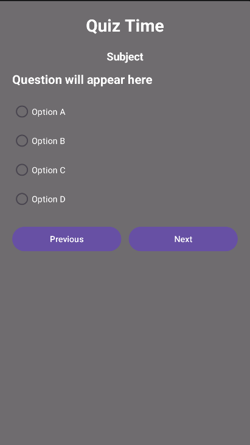
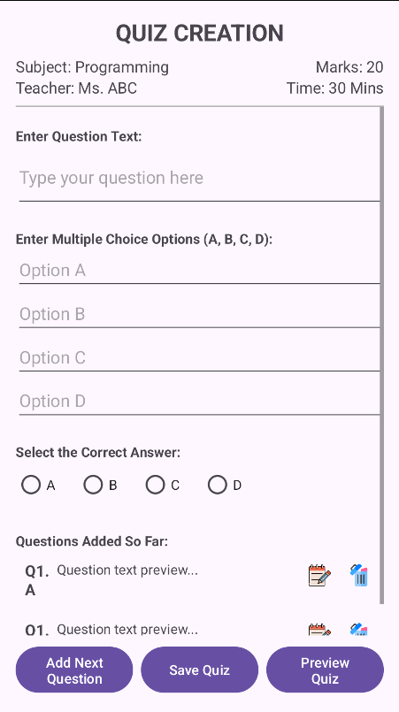
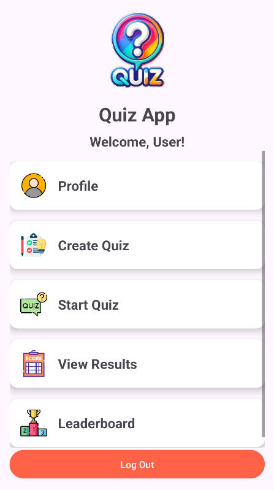
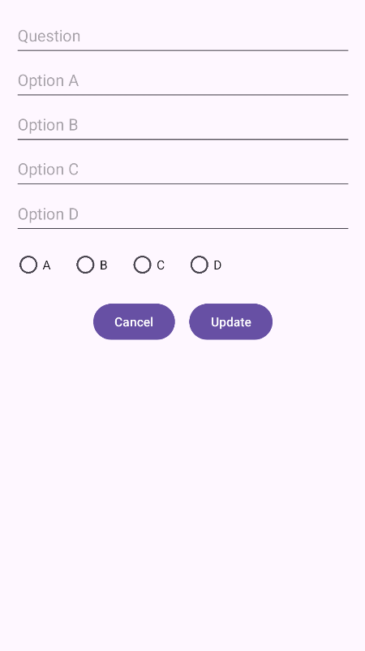
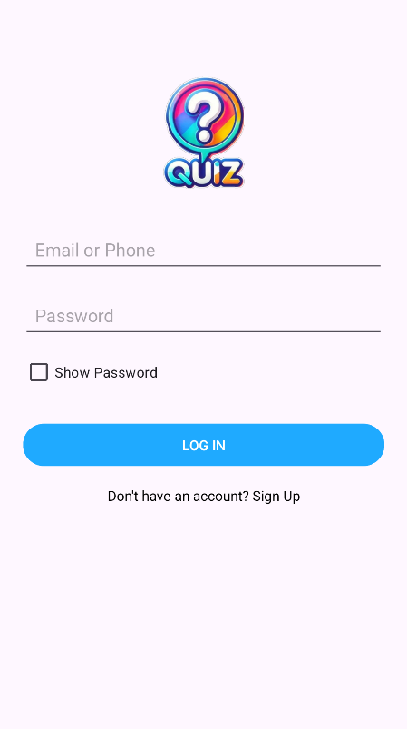
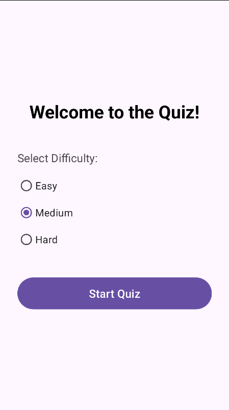
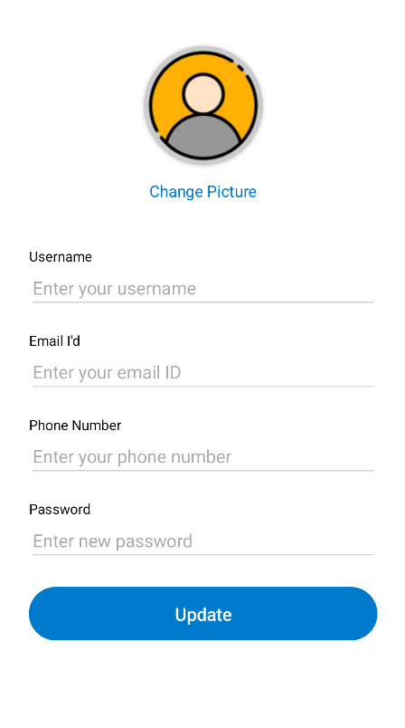
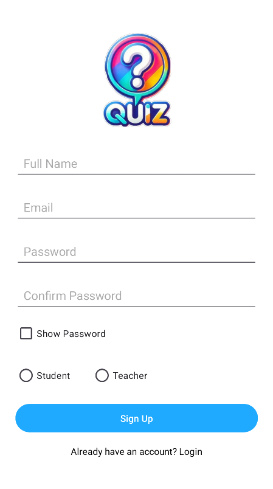
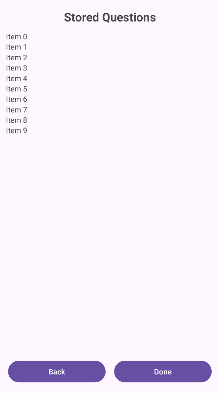

# Online-Quiz-App
An online quiz application developed using PHP, MySQL, HTML, CSS and JavaScript.
This project supports user authentication and role-based access.

## Features
- User login & signup
- Role-based access (Teacher / Student)
- Teachers can create quizzes
- Students can attempt quizzes
- Questions loaded dynamically from database

## Technologies Used
- PHP
- MySQL
- HTML
- CSS
- JavaScript

## How to Run
1. Install XAMPP
2. Place project folder in `htdocs`
3. Import database into phpMyAdmin
4. Update database credentials in `config.php`
5. Run project using `http://localhost/online-quiz-app`

## Screenshort

### Attempt Quiz Screen

### Create Quiz Screen

### Dashboard Screen

### Edit Question Dialog Screen

### Login Screen

### Preview Quiz Screen

### Profile Screen

### Quention Adapter Screen

### Question Item Screen

### Result Screen

### SignUp Screen

### Splash Screen

### View Quention Screen

## Author
Fatima Habib
