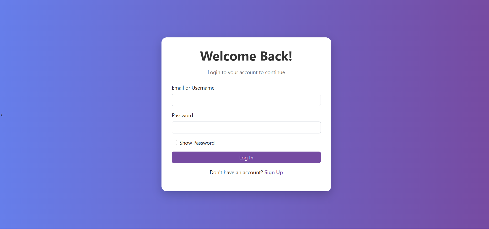
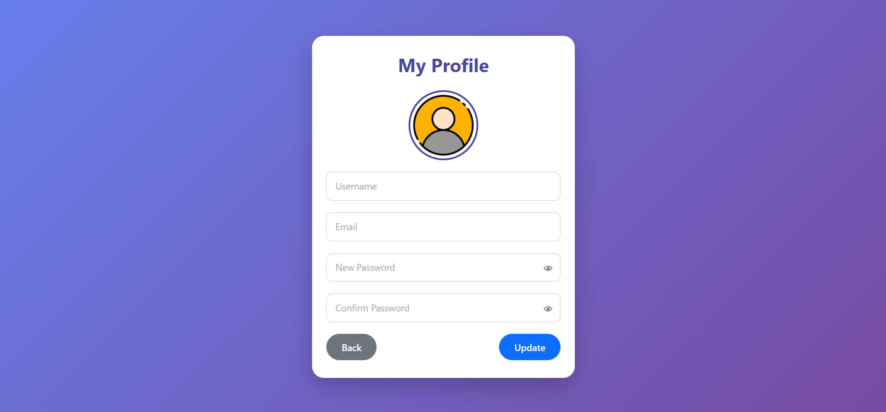
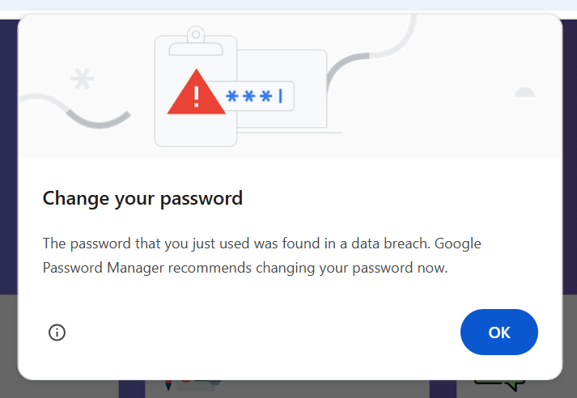
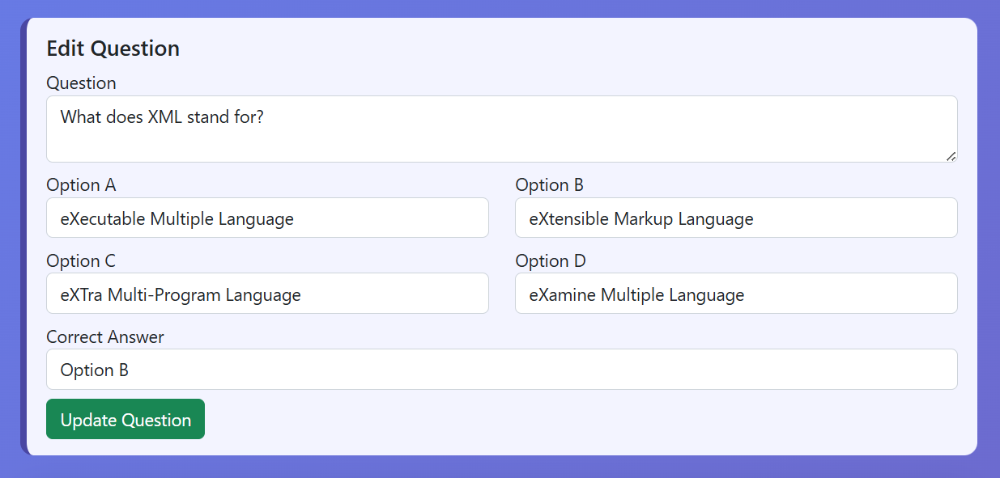
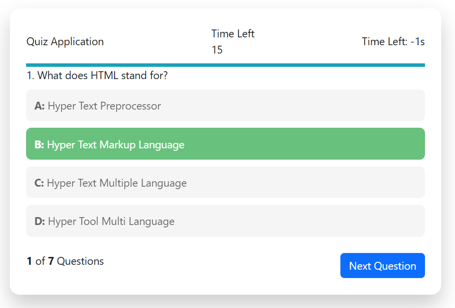
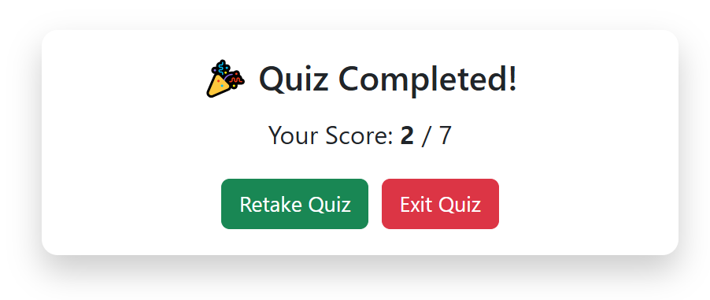

# Online-Quiz-App
An online quiz application developed using PHP, MySQL, HTML, CSS and JavaScript.
This project supports user authentication and role-based access.

## Features
- User login & signup
- Role-based access (Teacher / Student)
- Teachers can create quizzes
- Students can attempt quizzes
- Questions loaded dynamically from database

## Technologies Used
- PHP
- MySQL
- HTML
- CSS
- JavaScript

## 📸 Screenshots

### Login Screen

### SignUp Screen

### Login Teacher Screen

### Login Student Screen

### Profile Screen

### Weak Password Screen

### Create Quiz Question Screen

### Quiz Preview Screen

### Edit Question Screen

### Attempt Quiz Screen

### AfterTimeUp Screen

### Quiz Rules Screen

### Result Screen

## How to Run
1. Install XAMPP
2. Place project folder in `htdocs`
3. Import database into phpMyAdmin
4. Update database credentials in `config.php`
5. Run project using `http://localhost/online-quiz-app`

---

## Author
Fatima Habib
